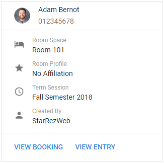

# Data Subscription posts to Google Hangouts Chat

Here are a few examples of ways that you can use Data Subscriptions to post directly into a Google Hangouts Chat room. This maps a [StarRez "Post to Web Service" Data Subscription](https://support.starrez.com/hc/en-us/articles/115000379306-Data-Subscription-Wizard-Step-3-Select-a-Task-Post-to-Web-Service-) to a [Google Hangouts Chat Incoming Webhook](https://developers.google.com/hangouts/chat/how-tos/webhooks).

How to: [Define an incoming webhook](https://developers.google.com/hangouts/chat/how-tos/webhooks#define_an_incoming_webhook) in Google Hangouts Chat


## Data Subscription Setup

### On what Action should we Post to a Web Service?
- When data is...**inserted into the selected table**
- Table Name: **Booking**
- Filter Records: *Optional*

### On Data Inserted, Post to a Web Service with the following information
- URL: **Your webhook URL** from Google Hangouts Chat
- Method: **POST**
- Auth Method: **None**
- Content Type: **application/json**
- Data: *See examples below*

### What should we call this Post to a Web Service Subscription?
- Name: *Whatever you like*
- Enabled: **Checked**
- Active Start Date: *Optional*
- Active End Date: *Optional*
- Comments: *Optional*

## New Booking Card

### Card Appearance in Hangouts Chat


#### Data for StarRez Web Service Post
```json
{
	"cards": [
		{
			"header": {
				"title": "{NewData_EntryID.NameFirst} {NewData_EntryID.NameLast}",
				"subtitle": "{NewData_EntryID.ID1}{#IF:NewData_EntryID.EntryDetail.PhotoPath}",
				"imageUrl": "{NewData_EntryID.EntryDetail.PhotoPath}",
				"imageStyle": "AVATAR{/IF}"
			},
			"sections": [
				{
					"widgets": [
						{
							"keyValue": {
								"topLabel": "Room Space",
								"content": "{NewData_RoomSpaceID.WebDescription|NewData_RoomSpaceID.Description}",
								"icon": "HOTEL"
							}
						},
						{
							"keyValue": {
								"topLabel": "Room Profile",
								"content": "{SELECT ProfileItem FROM RoomConfiguration JOIN RoomConfigurationProfile WHERE RoomBaseID={NewData_RoomSpaceID.RoomBaseID} AND DateStart<={NewData_CheckInDate} AND DateEnd>{NewData_CheckInDate}}",
								"icon": "HOTEL_ROOM_TYPE"
							}
						},
						{
							"keyValue": {
								"topLabel": "Term Session",
								"content": "{NewData_TermSessionID.WebDescription|NewData_TermSessionID.Description}",
								"icon": "CLOCK"
							}
						},
						{
							"keyValue": {
								"topLabel": "Created By",
								"content": "{NewData_SecurityUserID.FullName|NewData_SecurityUserID.UserName}",
								"icon": "PERSON"
							}
						}
					]
				},
				{
					"widgets": {
						"buttons": [
							{
								"textButton": {
									"text": "VIEW BOOKING",
									"onClick": {
										"openLink": {
											"url": "https://wfu.starrezhousing.com/StarRezWeb/main/directory#!entry:{NewData_EntryID}!booking:{NewData_BookingID}"
										}
									}
								}
							},
							{
								"textButton": {
									"text": "VIEW ENTRY",
									"onClick": {
										"openLink": {
											"url": "https://wfu.starrezhousing.com/StarRezWeb/main/directory#!entry:{NewData_EntryID}"
										}
									}
								}
							}
						]
					}
				}
			]
		}
	]
}
```
